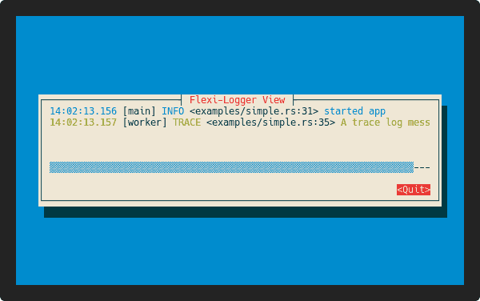

<h1 align="center">Welcome to cursive-flexi-logger-view 👋</h1>
<p align="center">
  <a href="https://github.com/deinstapel/cursive-flexi-logger-view/actions">
    
  </a>
  <a href="https://github.com/deinstapel/cursive-flexi-logger-view/actions">
    
  </a>
  <a href="https://crates.io/crates/cursive-flexi-logger-view">
    
  </a>
  <a href="https://docs.rs/cursive-flexi-logger-view">
    
  </a>
  <a href="https://github.com/deinstapel/cursive-flexi-logger-view/blob/master/LICENSE">
    
  </a>
  <a href="http://spacemacs.org">
    
  </a>
  <a href="http://makeapullrequest.com">
    
  </a>
  <br>
  <i>An alternative debug view for
  <a href="https://github.com/gyscos/cursive">gyscos/cursive</a>
  using
  <a href="https://github.com/emabee/flexi_logger">emabee/flexi_logger</a>
  </i>
</p>

---

This project provides a new debug view for [gyscos/cursive](https://github.com/gyscos/cursive) using the [emabee/flexi_logger](https://github.com/emabee/flexi_logger) crate. This enables the `FlexiLoggerView` to respect the `RUST_LOG` environment variable as well as the `flexi_logger` configuration file. Have a look at the `demo` below to see how it looks.

## How does it look like? `demo` [](https://github.com/faressoft/terminalizer)

<details>
  <summary>Expand to view</summary>
  
</details>

## Usage

Simply add to your `Cargo.toml`

```toml
[dependencies]
cursive-flexi-logger-view = "^0"
```

### Using the `FlexiLoggerView`

To create a `FlexiLoggerView` you first have to register the `cursive_flexi_logger` as a `Writer` in `flexi_logger`. After the `flexi_logger` has started, you may create a `FlexiLoggerView` instance and add it to cursive.

```rust
use cursive::Cursive;
use cursive_flexi_logger_view::FlexiLoggerView;
use flexi_logger::Logger;

fn main() {
    // we need to initialize cursive first, as the cursive-flexi-logger
    // needs a cursive callback sink to notify cursive about screen refreshs
    // when a new log message arrives
    let mut siv = Cursive::default();

    Logger::try_with_env_or_str("trace")
        .expect("Could not create Logger from environment :(")
        .log_to_file_and_writer(
            flexi_logger::FileSpec::default()
                .directory("logs")
                .suppress_timestamp(),
            cursive_flexi_logger_view::cursive_flexi_logger(&siv)
            )
        .format(flexi_logger::colored_with_thread)
        .start()
        .expect("failed to initialize logger!");

    siv.add_layer(FlexiLoggerView::scrollable()); // omit `scrollable` to remove scrollbars

    log::info!("test log message");
    siv.run();
}
```

Look into the [documentation](https://docs.rs/cursive-flexi-logger-view) for a detailed explanation on the API.

## Troubleshooting

If you find any bugs/unexpected behaviour or you have a proposition for future changes open an issue describing the current behaviour and what you expected.

## Development [](https://github.com/deinstapel/cursive-flexi-logger-view/actions)

### Running the tests

Just run

```
$ cargo test
```

to execute all available tests.

#### shields.io endpoints

[shields.io](https://shields.io) endpoints are generated inside the `./target/shields` folder. They are used in this README.

## Authors

**Fin Christensen**

> [:octocat: `@fin-ger`](https://github.com/fin-ger)  
> [:elephant: `@fin_ger@weirder.earth`](https://weirder.earth/@fin_ger)  
> [:bird: `@fin_ger_github`](https://twitter.com/fin_ger_github)  

<br>

**Johannes Wünsche**

> [:octocat: `@jwuensche`](https://github.com/jwuensche)  
> [:elephant: `@fredowald@mastodon.social`](https://mastodon.social/web/accounts/843376)  
> [:bird: `@Fredowald`](https://twitter.com/fredowald)  

## Show your support

Give a :star: if this project helped you!
